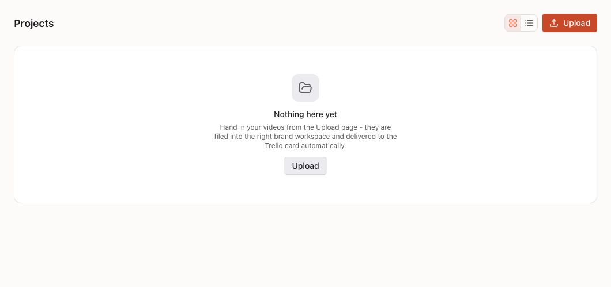
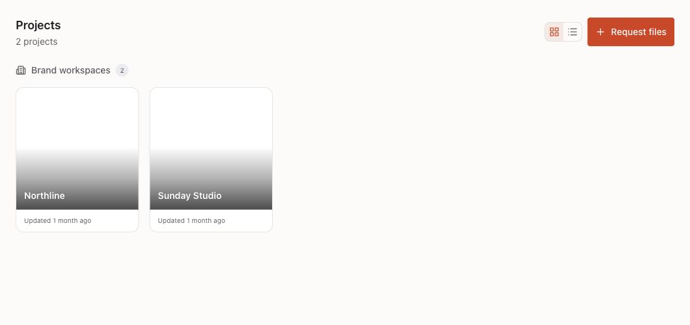

# Customer Projects — design handoff

## Job and scope
External brand owners see only their own or explicitly shared brands and collect editor deliveries through file requests. Web, desktop and mobile. Keep staff workspace, hand-in and Trello behavior intact. Reuse ProjectSection, EmptyState and RequestSheet; no new design system or dependencies.

## Navigation and hierarchy
Existing sidebar → Projects → brand workspace → request delivery folder. The primary customer action is **Request files**, opening the existing dismissible sheet. Creating a request refreshes the project list. A request started inside a brand preselects that brand. Staff keep **Upload** → `/handin`.

## Components and copy
| Before | After | Why |
| --- | --- | --- |
| Customer Upload → internal hand-in | Request files → existing RequestSheet | Collect deliveries through the customer's own link |
| Customer empty state mentions Trello | No projects yet; “Request files from your editor. Their uploads appear in your brand workspace.” | Describe the customer's actual workflow |
| Customer non-workspace projects hidden | All API-authorized customer projects visible | Respect existing membership isolation without hiding valid projects |
| Customer folder creation asks for a Trello link | Name only; no internal automation announcement | Internal card requirements belong to staff |

## States
Empty: explanation and Request files. Loading: existing skeleton. Error: show “Unable to load projects. Try again.” with Retry, not an empty-state claim. Success: project cards and request sheet confirmation. Permission denied: existing API membership checks; no client access bypass. Offline uses the same error recovery.

## Tokens and accessibility
Keep existing semantic OKLCH light/dark tokens, 4/8 spacing, 0.875rem headings and existing system font. Primary action minimum 44px touch target, flexible header at 375px. Keep focus rings, descriptive icon labels, keyboard activation and sheet Escape/Close behavior. No added animation; existing reduced-motion behavior retained. Existing shared components retain their typography and color scale.

## Open decisions
None. Customer Projects contains brand workspaces and their own submitted files; the Overview already provides the request board. No automatic import of internal Trello deliveries.

## Verification checklist
- [x] Customer empty/list/error states and request action regression tests
- [x] Staff workspace-only view and Upload unchanged
- [x] Customer folder creation excludes the internal Trello requirement and announcement
- [x] Screenshots inspected at desktop and mobile, light and dark (375px mobile: no horizontal overflow)
- [x] Backend: 358 passed, 48 skipped without live test PostgreSQL. Frontend: 438 passed; type check, lint and production build pass. Preview API contract checks: four passed.

## Evidence

The after image uses synthetic local data, not the live customer's projects. A request created from Sunday Studio preselected that brand and appeared in both the folder tree and main grid without a reload. Phone and second-owner production acceptance remain open; these UI checks do not replace them.

HIG deviation: reuse existing web card/empty-state components rather than redesign their typography. This is a role/workflow correction.
