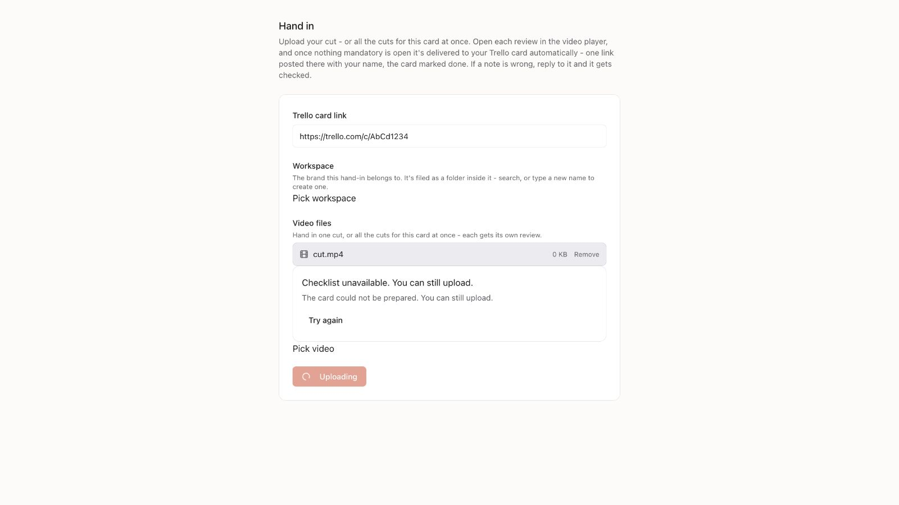
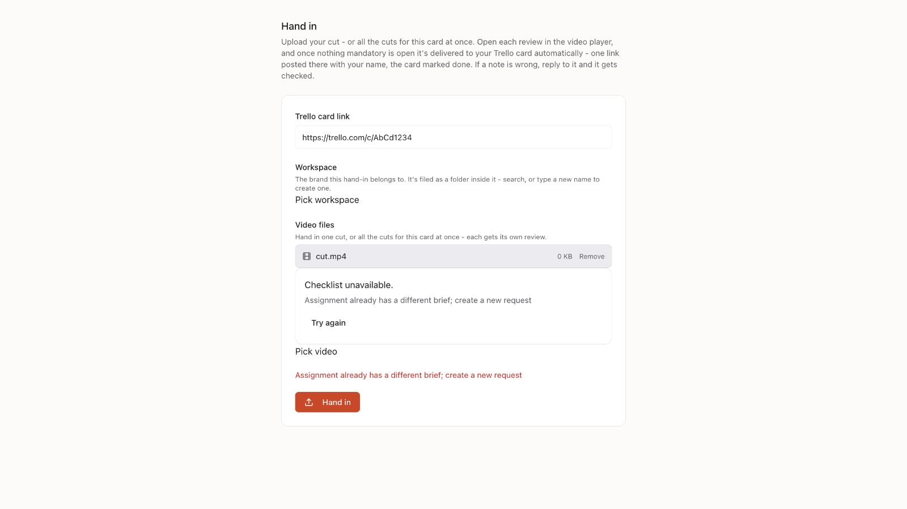
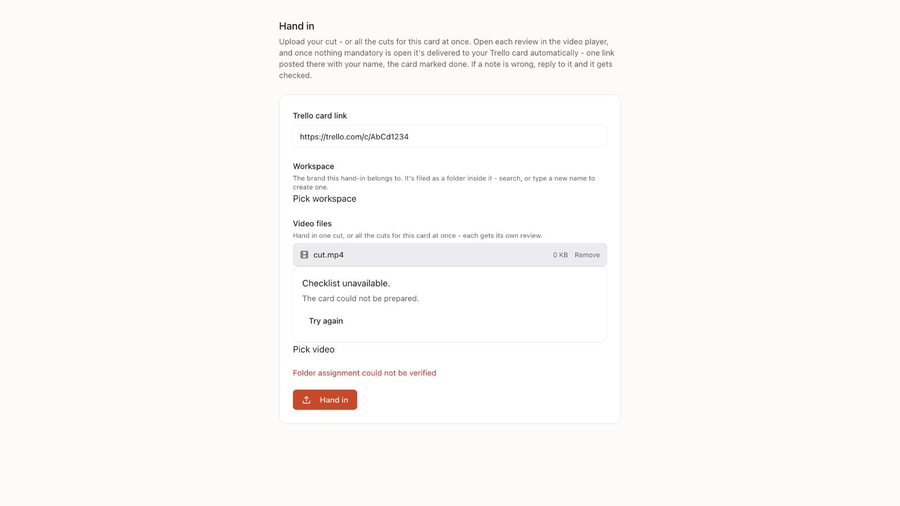

# Design handoff — hand-in brand conflicts

## 1. Job
Staff editors submit a complete ad to an existing workspace. A confirmed assignment
conflict must stop before any file is uploaded, and show the existing server recovery
instruction. Platforms: mobile and desktop web. Success: 409 is visible with no upload;
optional preparation outages retain the existing upload fallback.
Fallback also requires the existing server editor-assignment check before upload;
unverified or foreign folder scope stops with the existing inline recovery text.

## 2. Screen inventory and navigation
| State | Entry | Presentation | Exit |
| --- | --- | --- | --- |
| Existing Hand in form | Selected workspace, card and file | Existing page | Submit or edit selection |
| Confirmed conflict | Checklist preparation returns 409 | Existing inline error | Create a new request or choose the correct workspace |
| Optional preparation unavailable | Preparation returns 503 | Existing checklist notice | Existing upload flow |

Navigation stays in the existing page. No new dialog, page, or navigation choice.

## 3. Content hierarchy
The existing workspace/card controls, selected files, inline recovery text and Hand in
button keep their current order. A known conflict must not claim upload can continue.

## 4. Components
| Element | Pattern | Role and copy | Notes |
| --- | --- | --- | --- |
| Checklist failure | Existing ChecklistPanel | Server's conflict instruction for 409 | No new component |
| Submit failure | Existing inline `role=alert` | Server's conflict instruction | Happens before startUpload |
| Hand in button | Existing Button | Hand in | Returns to enabled form state on conflict |

## 5. States
Empty, loading and success keep the current screen. Error uses the existing inline
feedback; selected files and card remain available. Offline/503 keeps the existing
optional-preparation fallback. A confirmed 409 stops before any upload side effect.

## 6. Tokens
Keep the existing typography, semantic OKLCH colors, 4/8px spacing grid and controls.
The error uses text-sm and the existing semantic status-error color token. No new motion or animation.

## 7. Accessibility
Retain native labels, focus, keyboard order and existing touch targets. The submit
error remains a text-bearing alert; color is not the only signal. No new clipped
content, fixed dimensions or motion. Review the actual error region at mobile/desktop.

## 8. Open decisions
No design decision needed. Business confirmation of the two workspace brands remains
separate from this existing error-path correction.

## 9. Review checklist
Capture the existing component with local transport fixtures before/after the guard,
inspect the error region, and verify 409 prevents upload while 503 permits fallback.
Apple feedback/writing principles support visible, actionable error feedback. Upload
fallback and inline panel specifics are web choices, not HIG component prescriptions.

| Before | After | Why |
| --- | --- | --- |
| Confirmed 409 is swallowed; upload can start | Existing inline error before upload | Prevent side effects after a known assignment conflict |
| Preparation notice always says upload is available | Confirmed conflict shows its recovery instruction | Keep the status truthful |
| First503 reuses an unchecked old folder | Existing editor-request validates before upload | An optional checklist outage cannot authorize an assignment |

## Visual evidence
| Before | After |
| --- | --- |
|  |  |

Inspected the actual React Handin component DOM with local transport and picker/upload
fixtures, rendered with the compiled application CSS in the in-app browser. The recovery
text is legible in light and dark appearances; selected input is preserved and the form
returns to its enabled state. The mobile check had an actual CSS viewport of 469px and
no horizontal overflow. Desktop captures are 1600×900. This is component visual evidence,
not an authenticated live end-to-end journey. Regressions verify no upload on 409,
the existing upload fallback on 503, retained conflicts through retry outages,
successful recovery, key isolation and conflict priority over cached checklist data.

The review delta also checks an initial preparation503 followed by an unverified
assignment. The existing error region preserves the card/file selection, returns
the form to enabled, and withdraws the upload-allowed notice. Inspected with the
same fixture/CSS method in desktop light and actual469px mobile light/dark; no
horizontal overflow. This is visual component evidence, not a live browser journey.

