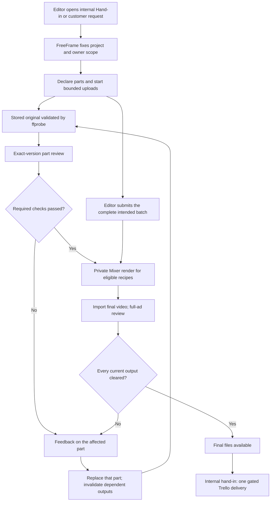

# Parts-based hand-in

Optional integration; **off by default**. Existing complete-ad upload remains available. No production rollout was performed during implementation.

Editors upload each unique hook/body once (optional bridge and CTA). Simple requests use the existing mixer's selected-stage Cartesian combinations. Explicitly planned requests retain their recipe constraints. A brief supplies review context; parsing it is not required to declare the inputs.

The browser transfers at most two files simultaneously, each through the existing three-chunk multipart uploader. A server-validated original can be reviewed before playback renditions finish. Existing review queue quotas remain; this change does not raise global model concurrency or claim a latency benchmark.

## Ownership and access

FreeFrame derives `owner_id=freeframe:<project-created_by-uuid>` and `brand_id=freeframe:<project-uuid>` server-side. Editor attribution is separate. These are canonical private-engine scopes; they are not an implicit mapping to a Whop account or the public winners library.

Only authenticated project owners can list/download private originals through FreeFrame. Editors see their task and feedback, not the owner's rule-management tools. Private sources never become public CDN objects. Original files are indexed by Mixer after input validation and retained outside scratch/public roots. The library appears in **Reusable parts**; a reviewed source does not automatically become a winning ad.

## Configuration and activation

| Service | Setting | Purpose |
| --- | --- | --- |
| FreeFrame API/worker | `ITERATIONS_ENABLED=true` | Enables request orchestration. Leave false until all services are prepared. |
| FreeFrame API/worker | `MIXER_ITERATIONS_URL` | HTTPS service origin only, for example `https://mixer.example.test`; FreeFrame appends `/api/internal/iterations`. |
| FreeFrame API/worker | `MIXER_ITERATIONS_SECRET` | Must match Mixer's private Bearer secret. |
| FreeFrame API/worker | `REVIEW_BRIDGE_URL`, `REVIEW_BRIDGE_SECRET` | Exact review and delivery adapter, matching AutoReview's service authentication. |
| FreeFrame web build | `NEXT_PUBLIC_HANDIN_COMPONENTS_ENABLED=true` | Exposes internal parts hand-in, owner request option and private parts library. Build-time public flag, no secret. |
| Mixer | `MIXER_ITERATIONS_SECRET`, `MIXER_ITERATIONS_MEDIA_HOSTS`, durable `MIXER_DATA_DIR` | Service auth, exact source-host allowlist and persistent private jobs/originals. |

Do not paste or commit credentials. Apply the new forward Alembic migration before starting new API/worker code. Run compatible AutoReview/Mixer adapters first, then API/worker/beat, then enable the frontend build flag. The runtime flag alone cannot alter a previously built Next.js bundle.

The existing n8n feedback views and automation webhook contracts are unchanged. This path uses direct service adapters plus durable Celery tasks for part-level work; a generic webhook is not needed for each hook/body. A separate outbound hub-events webhook does fire on guest comments and completions for hand-in requests created here - see `apps/api/services/hub_events.py` and the `HUB_EVENTS_WEBHOOK_URL` entry in CHANGELOG.md.

## HTTP contracts

| Caller | Endpoint | Contract |
| --- | --- | --- |
| Owner | `POST /requests` | Add `receive_iterations:true`, optional aspect ratio; brief remains optional. |
| Internal editor | `POST /handins` | Authorized `project_id`, Trello `card_url`, required operation UUID `idempotency_key`; returns resumable request token/URL. Same-intent retries reuse the saved title and assignment. |
| Request editor | `POST /r/{token}/iterations/parts` | Add stable client IDs, explicit role and filename label before upload. |
| Request editor | Existing `/r/{token}/upload/*` | `slot_id` pins source role; explicit `asset_id` selects a revision. |
| Request editor | `POST /r/{token}/iterations/submit` | Seal intended membership after all declared bytes are stored. |
| Request editor | `GET /r/{token}/iterations` | Current slots/outputs, `submitted`, `can_leave`, `editor_done`, final delivery state. |
| Request editor | `DELETE /r/{token}/iterations/parts/{slot_id}` | Remove accidental declarations before sealing; active transfers cannot be removed. Originals are not hard deleted. |
| Request editor | `POST /r/{token}/iterations/retry` | Explicitly recover failed checks/jobs; ordinary retries retain idempotency keys. |
| Project owner | `/projects/{id}/iteration-parts[/<part_id>/file]` | Private authenticated list/download; browser never receives engine credentials. |
| FreeFrame → reviewer | `/api/v1/requests`, `/api/v1/iterations/review`, `/api/v1/iterations/deliver` | Register exclusions/context, exact part/final review, whole-batch delivery. |
| FreeFrame → Mixer | `/api/internal/iterations/render`, `/jobs/{id}[/file]`, `/parts[/<id>/file]` | Existing private renderer and private reusable originals. |

Detailed adapter contracts live in the AutoReview and Mixer repositories: `docs/contracts/iterations-review.md` and `docs/contracts/freeframe-private-parts.md`.

## Completion and recovery

“Uploaded” means stored bytes, “checked” means required checks for the exact version, and “delivered” means current final outputs plus required internal delivery completed. Source checks alone never approve a final ad. Partial delivery is counted separately. Closing the tab does not cancel accepted jobs; incomplete local transfers still require the browser.

Native Parts reviews require a persisted checklist binding and frozen snapshot before registering or scoring any source. Registration carries the frozen briefing and exact binding/hash/optional plan metadata; derived shares inherit that identity. Every native review requires saved context, so a lost Worker registration marker stops scoring instead of falling back to current rules. The private iteration snapshot read accepts only the current source version or a current derived recipe whose source versions still match the database. Verified findings use the trusted exact-version comment bridge and retain Basics/Brand/Briefing provenance. The existing ordinary-review snapshot contract still permits its original historical versions.

URL/PDF briefing inputs remain private while preparation is pending; native Parts registration waits for the frozen snapshot rather than resolving mutable inputs independently. Once acknowledged, pending inputs are removed. Guest projections never include those private inputs. Private original downloads preserve the actual video content type and filename, including MOV and WebM.

Aborted first uploads retain the declared slot but release the failed asset binding; aborted revisions restore stored prior bytes for a fresh check. A late abort cannot detach a newer attempt. Replacement invalidates only recipes referencing that slot. Generic upload/version endpoints cannot bypass the iteration state machine. Service outages appear as unavailable/retry, not creative failure. Policy changes invalidate review evidence. Internal delivery is serialized through the FreeFrame durable lease; AutoReview records immutable receipts and reconciles Trello retries. The Worker KV store is not a general concurrent transaction lock.

Inputs are videos up to 200 MiB each; the private renderer currently accepts 2–4 ordered sources and a combined recipe duration of at most 600 seconds. Mixed aspect ratios, separate CTAs and unusually long exports still require a representative staging check before broad activation.

## Acceptance evidence

Automated tests exercise the real request/worker transitions and exact-version contracts; optional PostgreSQL tests exercise persistence and leases. UI screenshots in `docs/design/handin-evidence` use local synthetic fixtures, not live customer submissions. The fixtures demonstrate layout and interactions; they do not prove production timing, model quality or live Trello delivery.

Before activation, run a staging batch with two hooks and one shared body; replace only one hook; verify no duplicate render/delivery on retry; verify another account cannot list/download originals; reopen the submission; verify service-failure recovery. Production performance and deployed secret/config compatibility still require that controlled activation check.

## Native complete-ad editor and legacy links

Staff complete-ad Handin calls `POST /folders/{folder_id}/editor-request` after upload. The endpoint reuses the current project/folder, public comment share and actual asset versions, without inventing transfer timing. It returns canonical backend-configured `/r/{token}` and customer `/share/{token}` URLs. Existing protected, revoked, ambiguous or foreign assignments are rejected rather than widened or recreated. The result shows the customer share first and **Open review** for the native player, feedback, seeking and version history.

Legacy Worker `/u` and `/d` links are migrated only by explicit service-authenticated `POST /api/v1/editor-links`. Both the original live scope and native assignment must match exactly. FreeFrame's private `POST /internal/review/editor-bindings` serializes claims in PostgreSQL and retains original identity after revocation. Its private GET is authoritative on every legacy visit: only an explicit never-mapped response permits the old flow; a revoked/changed mapping returns 410 and an unavailable read returns 503. KV is a cache, never permission to reopen a mapped capability. No production mappings were created during qualification.

The production Celery worker/email-worker/beat commands use `exec` so Celery receives SIGTERM as PID 1, with 5-minute/90-second/30-second grace periods respectively. The qualification report records isolated real signal/drain evidence and separate production-acceptance limits.
