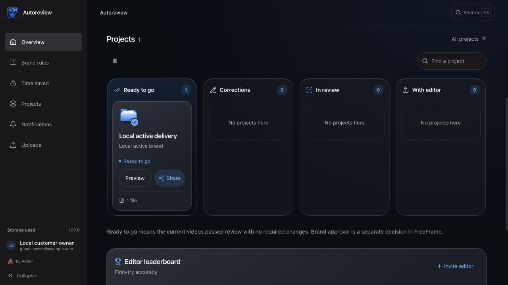
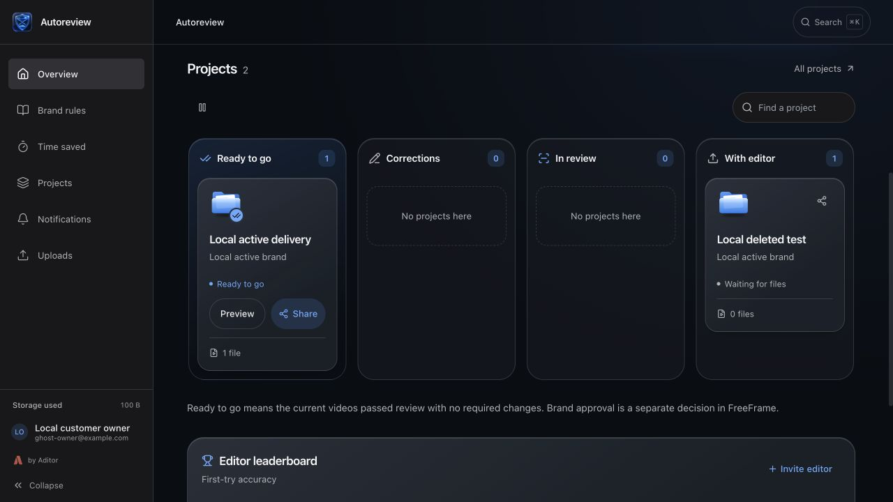

# Recoverable request and share visibility

## Change

An existing preview request still appeared in Overview after its folder was moved to Recently Deleted. The editor link already refused uploads, but GET /requests did not filter deleted folders. Overview and its stage counts consume this response directly; refreshing Whop reproduced the ghost, so this was not solely a stale browser cache.

Filter request folders in SQL before the existing100-row limit. This retains active customer deliveries, permissions, URLs and states, and revives the original request when its folder is restored. No frontend or Share-dialog code changes.

A separate real-PostgreSQL synthetic nonempty fixture proved that after deleting a project, folder/asset/project share tokens still returned metadata, public comments and download URLs. The common share validator now rejects a missing/deleted direct target or project with the existing404 response. Active shares retain their behavior; restoring the parent restores the same token. No link revocation, new token, model or schema change.

## Verification

- Baseline existing focused suite59 passed. All8 new real-PG HTTP regressions failed for the intended behavior before the fix: ghost rows, pagination starvation, deleted project share responses200/200/200, and deleted folder metadata200.
- Final complete API suite:741 passed, zero skips; dedicated local PostgreSQL migrated to d5, with iteration, strict H2 and n8n opt-ins. Two existing dependency deprecations remain.
- Frontend:604 tests/92files pass, production build succeeds, TypeScript and lint exit0. Existing jsdom scrollTo and image/effect-dependency lint warnings remain.
- Real local Next.js/API/Postgres browser, normal customer password login: baseline Projects2/With editor1 despite deleted folder; corrected Projects1/With editor0 with activeReady1/file1 preserved; normal Recently Deleted→Restore brings Projects2/With editor1 back without new request or token. Review/provider responses are synthetic, with no media upload or provider call; this does not certify paid-customer quality.

## Boundaries and rollback

Production investigation after the existing test cleanup was read-only. No new production request, account, rights, quota, media, model call, Trello delivery, Parts/Mixer/Engine setting, tag, merge or deploy was performed. Root owns deployment; this report makes no live-fix claim. The actual Whop iframe input remains separately unverified.

The local repeated Delete confirmation encountered an automation dialog/focus failure. Restore and the before/after Overview evidence above were already captured. The local empty fixture was subsequently soft-deleted through the existing backend delete_folder function; no successful second browser Delete is claimed. The production test remains independently restorable as documented in the private H4 handoff.

Reloading the same synthetic customer share in the actual local browser after that soft delete displayed "Link not found". The independent read-only review of base `6453182` through implementation head `ea28b6d` found no actionable defect and approved the scoped change. It inspected the recorded test/browser evidence without rerunning it. Existing post-limit filtering of inaccessible/deleted projects and already-issued storage URLs remain separate boundaries.

Rollback is an API image/code revert only: there is no migration or data mutation in this fix, and no share token is revoked. A revert reintroduces the old visibility behavior. Already-issued presigned/HLS URLs retain their existing lifetime; this guard prevents new disclosure through the share API rather than changing storage-token expiry.
