# H1 — saved checklist handoff, 2026-10-07

Status: **code_verified** with the limitations below. **Engine integration_verified=false; live_verified=false.** No merge, deployment, release, paid model call, production write, Trello comment, or cross-chat message was performed.

## Delivered

H1A Worker freezes full input/provenance and exposes an optional authenticated plan adapter. H1B stores the authorized intent/snapshot/plan and independent durable registration retries in Postgres/Celery. H1C shows a private saved disclosure during internal Trello preparation. Following Alan's correction, customer link creation/reopen stays focused on sharing: no checklist or logo editor appears there. Logo editing remains in Brand rules. The guest upload page and public gate do not expose criteria. Internal paste/preparation creates no folder; the eventual folder adopts the same binding.

## Verification

| Check | Result |
|---|---|
| API full suite, disposable Postgres available | 522 passed, 8 skipped, three existing dependency warnings |
| Web full suite | 546 passed in 81 files |
| Web build / tsc / lint | Passed; existing lint warnings remain |
| Worker full suite | 1,415 passed in 127 files |
| Worker TypeScript | Existing baseline 161 diagnostics; head 161, zero new normalized diagnostics. This is not a clean tsc pass. |
| Real disposable Postgres | Migration upgrade/downgrade/reupgrade; four concurrent intent reservations; four concurrent customer creates returning one request/link/folder; rollback; reconnect; ready-reference delivery failure and restart; recovery past 50 exhausted registrations |
| Browser | Synthetic local FastAPI + real DB and built UI, injected bridge responses. Desktop and actual 390×844 viewport, light/dark, preparing/ready/unavailable, reload, scroll, working guest upload. No Engine/model review. |

The Postgres concurrency test calls real routers/services with real sessions, not a full HTTP concurrency/load test. Shared canonical fixtures cover Unicode, newlines, decimal thresholds and numeric object keys. Worker timeout-after-acceptance tests check byte-identical retries; they do not prove Engine deduplication.

## Independent review and one fix pass

A fresh gpt-6-astra reviewer inspected Worker 2e7e5e2..7334e0d and FreeFrame 2e720a3..031a1c9. One Critical and five Important issues were reproduced with failing regressions, then corrected:

| Finding | Correction and evidence |
|---|---|
| Customer URLs could invoke private Trello credentials | Only verified staff canonical card identities enter snapshot resolution. H1 preliminary registration strips/blocks Trello URLs. Worker regressions + API registration test. |
| Final registration failure could lose its pending marker | Changed context/plan references commit pending registration before delivery; task relocks the latest row. Restart regression plus real Postgres failure/retransmission proof. |
| Immutable briefs could be silently partial | Strict intake keeps full direct text, all supported Trello scripts/comments, paginated/nested Notion content, or rejects incomplete/oversized reads. Long/two-document/pagination/failure regressions. |
| Old registration failures could starve restart recovery | Separate bounded attempts/backoff, lifecycle retirement, fair eligibility. Unit regression plus 50-row Postgres sweep proof. |
| Legacy adoption required a fresh Trello lookup | Save verified canonical/short mapping and validate same-project/card locally. Offline adoption regression. |
| Former project creators could read private criteria in list | Recheck current role and project lifecycle before emitting requests/checklists. Revoked-member/deleted-project regressions. |

There was one final review and one fix pass; no second independent review is claimed. No deferred minors.

The final author/CI checks added two regressions within that fix pass. A late retry failure from checklist A no longer changes checklist B's UI (RED→GREEN; full 546-test web suite/build/types/lint pass). The initial GitHub backend job exposed missing retention-GC handling for the three new foreign keys. Three real-Postgres regressions failed before the fix and pass afterward: request, folder and project GC remove only their scoped bindings, including tombstones, while unrelated bindings survive. The FK floor guard was extended after adding the real cascade. The complete API suite was rerun with Postgres reachable: 522 passed, 8 skipped. The earlier local run (476 passed, 51 skipped) had skipped the real-DB cleanup file, which hid the gap.

## Decisions and limits

- Postgres/Celery owns durable state; Worker is a resolver/transport, avoiding a second mutable KV outbox. Cost if wrong: change the adapter boundary; no compiler rewrite required.
- Browser evidence is synthetic because the Engine plan API is unconfirmed. Cost if wrong: real integration evidence remains mandatory before live activation.
- Engine compilation, durable dedup and V1/V2/V3 review consumption remain Engine-owned. Cost if wrong: activation stays blocked until that integration passes; enabling the Worker flag alone is insufficient.
- No production activation/delivery verification was attempted; only Draft PRs were authorized. Cost if wrong: rollout remains a later explicit step.
- 200% zoom shortcuts had no effect; reduced-motion emulation is unavailable in the exposed browser API. The checklist itself has zero computed animation/transition duration, but these acceptance checks remain unverified. Cost if wrong: human/browser acceptance remains before merge.
- Existing broad staff access and legacy brand matching remain platform policy. H1 adds current-role checks and an ambiguity guard. Cost if wrong: separately scope a permission/brand-policy change.

Migration a1c7e10b2026 currently follows e4f5a6b7c8d9 and includes registration retry fields. Parallel migration work must be chained on integration. The proposed Engine contract is in the Worker docs/checklist-bridge.md. The optional adapter is off by default.

## Browser evidence

### Current share revision — Alan's correction

The original share-dialog checklist was misplaced: that screen's job is to copy/send the link. The two checklist render sites and the new-link logo editor were removed. No new checklist destination was added; Handin remains the existing checklist surface. Earlier owner checklist screenshots below are historical implementation evidence, superseded by this revision. Current desktop browser proof uses the built client and synthetic API: new-link and reopened dialogs show only sharing content, copy reports success, and the resulting guest upload page opens. The full 546-test web suite, build, types and lint pass; existing warnings remain. This bounded removal reuses existing tests rather than adding tests that merely assert removed JSX.

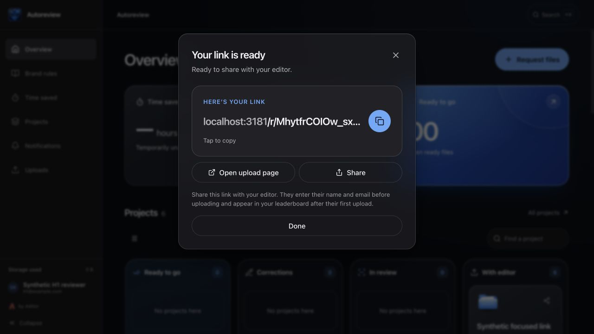
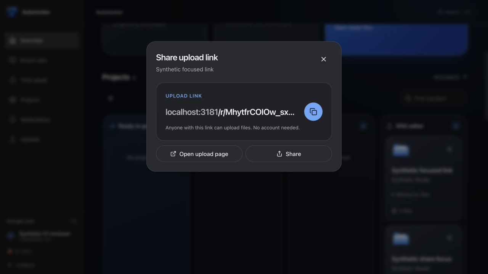

### Original H1 evidence

All data is synthetic. Before image is the exact FreeFrame base 2e720a3, rendered separately against the same local fixture API. The added checklist exposed a stale dialog scroll position; reset-on-create and a bounded desktop height corrected the clipped heading.

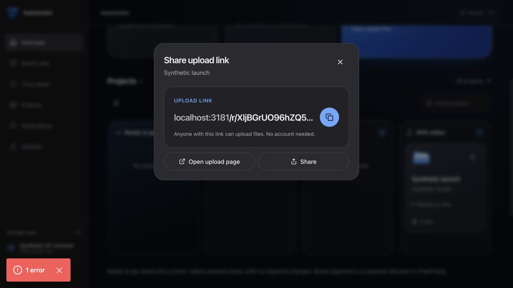
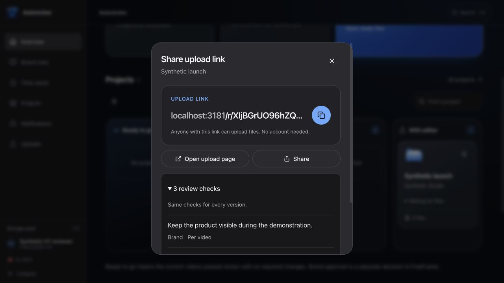
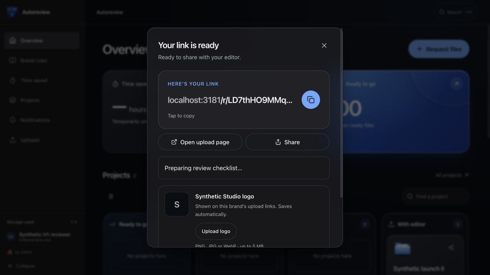
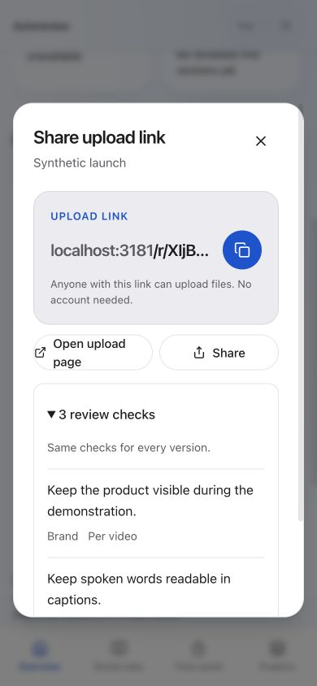
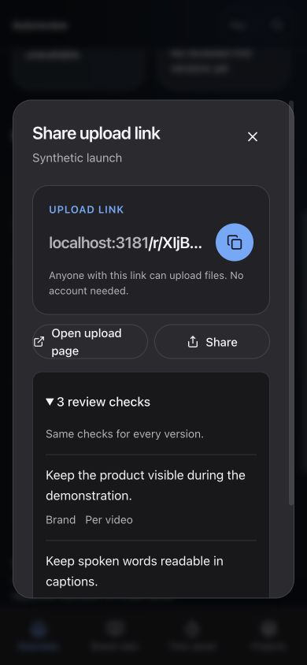
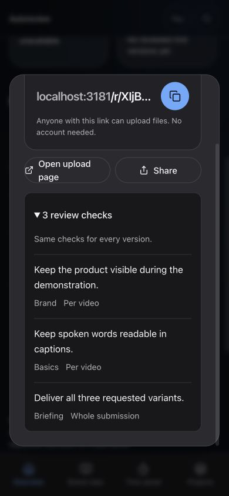
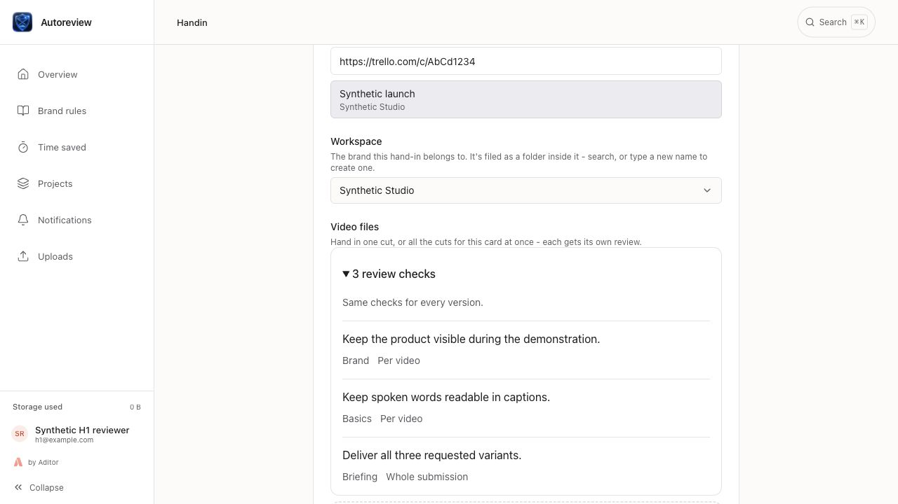
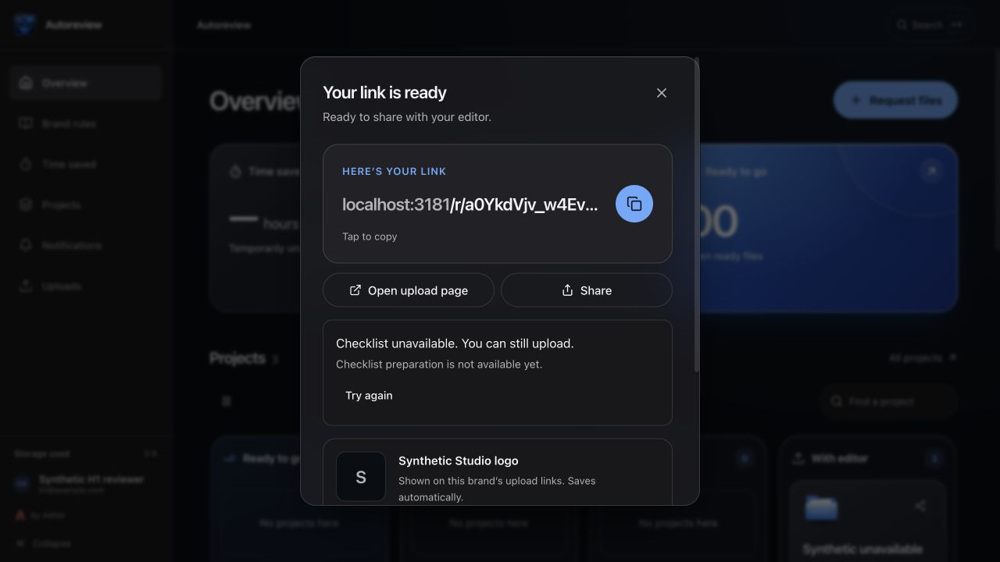
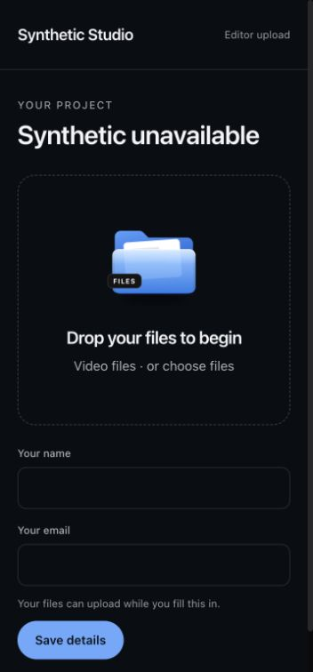

Final built-client smoke after the six fixes: a new customer request produced a working link while pending, then three saved checks. Internal preparation required explicit choice between two matching fixture workspaces, retained the verified short-card mapping, became ready, and had no folder/request in real Postgres.

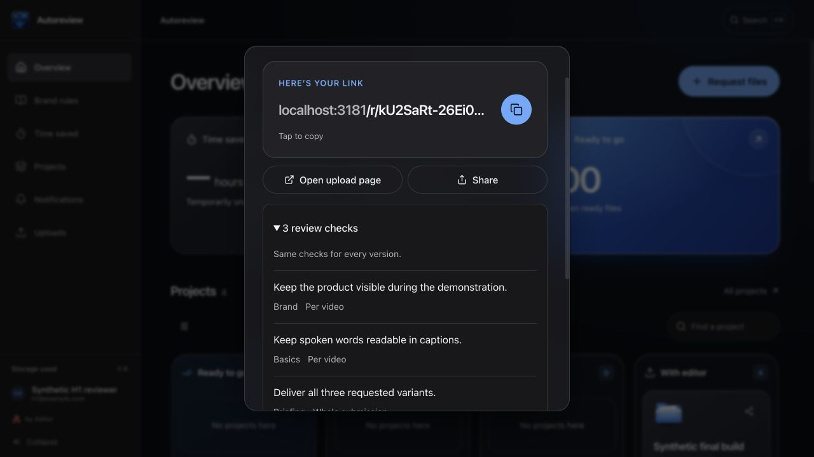
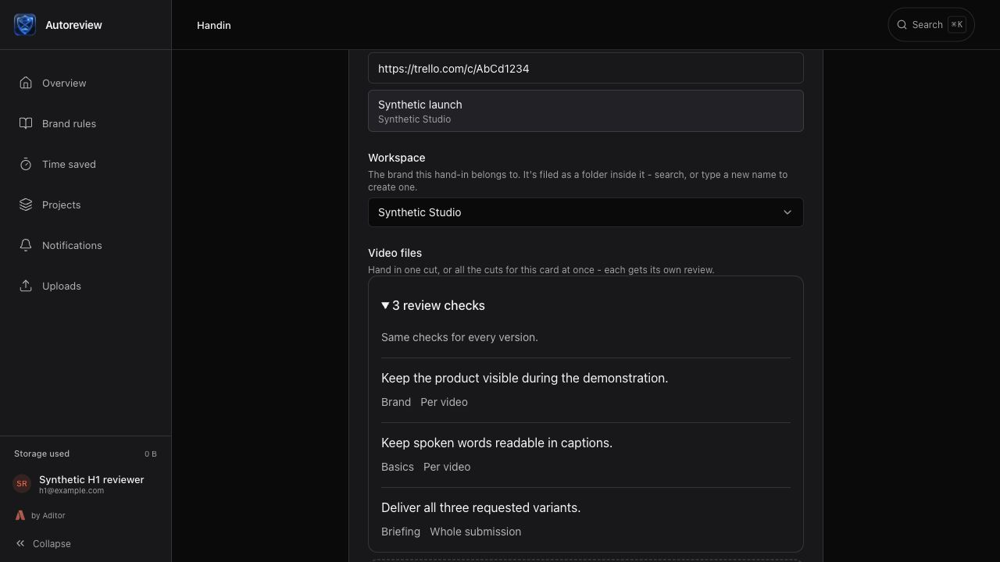
