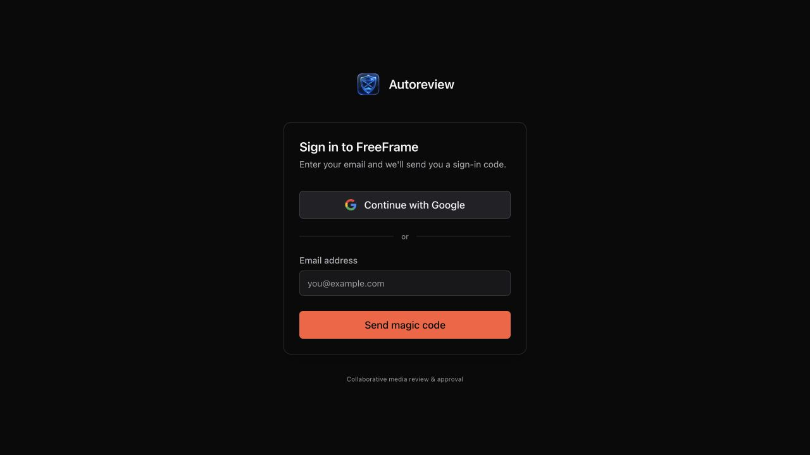

<!-- abnahme
repo: videoaditor/freeframe
branch: codex/autoreview-h4-acceptance
base: 2e720a39f66142533e2b2de70894cd8ada89bcec
title: H4 standalone acceptance — evidence and open integration
status: integration-blocked
preview: screenshots
preview_url: none
verify: pytest; web build/test/tsc/lint; Worker npm test; same baseline TypeScript diagnostics; opt-in bridge smoke
-->

# H4 — Standalone-Abnahme vom 07.10.2026

**Die verfügbare Codeprüfung ist belegt; die Abnahme beider vollständiger Abläufe bleibt offen.**
Docker brach beim eigenen Image-Build mit EOF ab, danach fehlte der Socket; der Mac lief
zwischenzeitlich in ENOSPC. Keine reale H4-Datenbank, kein Upload, keine technische Verarbeitung
und keine Review-Kommentarpublikation wurden in diesem Stack ausgeführt. Nach den begrenzten
Versuchen wurde dieser Integrationspfad gestoppt. Das ist keine Produktfreigabe.

Die [maschinenlesbare Matrix](h4/matrix.json) enthält33 Einzelzeilen mit passed/failed/pending,
Umgebung, exakten Commits und Evidenz. Drei fehlgeschlagene Versuche bleiben sichtbar:
Node25-Testlauf, überlasteter paralleler Node22-Lauf und Stackstart. Die später bestandenen
Prüfungen überschreiben diese Historie nicht. [API-Journeys](h4/journeys.json) und
[Runbook für Wiederholung, Bereitstellung und Backout](h4/RUNBOOK.md) benennen alle nötigen
Schritte. Die noch nicht ausgeführten Journeys sind ausdrücklich pending.

## Ausgangsbasis und Unterschiede zu live

| Stand | Frisch belegtes Ergebnis |
| --- | --- |
| FreeFrame main | `2e720a39f66142533e2b2de70894cd8ada89bcec`; eigene isolierte Arbeitskopie, kein Produktcode geändert |
| Worker main | `2e7e5e2460e8defedc4b24bbe1457b10b4b3a5ad`; H4-Testfixture `a30aa30eb516bd4d4b541f86ae3deb11ddaf2d37` ([Draft-PR81](https://github.com/videoaditor/feedback-agent/pull/81)) |
| Überlappung | PR56 jetzt gemergt (`fc56583c…`); Worker PR75 weiter offen; reservierte PR150/79/51 nicht geändert, übernommen oder gemergt |
| Live-Einstieg | `review.aditor.ai/o` →302 auf unabhängigen FreeFrame-Login; Login/Health HTTP200; Google aktiviert |
| Live-Images/Commits | unbekannt: Health liefert nur `ok`, GitHub-Deploymentliste leer; dokumentierte Ops-/Cloudflare-Credentialdatei fehlt. Kein Branch-/Live-Gleichheitsbeleg |

Inventar: [Umgebung](h4/evidence/environment.json), [FreeFrame-PRs](h4/evidence/freeframe-prs.json),
[PR56](h4/evidence/pr56.json), [read-only Live-Proben](h4/evidence/live-readonly.json).
Private Worker-PR-Inventare bleiben im lokalen H4-Run-Ordner. Keine Secretwerte exportiert.

## Ausgeführte Checks

| Check | Ergebnis / praktischer Umfang |
| --- | --- |
| Backend `python -m pytest apps/api/tests/ -v` | **461 passed, 51 skipped**, exit0. Bestehender Python 3.12-Abhängigkeitsruntime nur gelesen; DB gemockt, Postgres nicht belegt |
| Frontend Build / TypeScript / Lint | exit0; Lint mit vorhandenen Warnungen |
| Frontend Tests | **80 Dateien / 535 Tests bestanden**, Node 22.22.3, `--maxWorkers=2`; Zieltest für mobile Kommentare separat bestanden |
| Worker `npm test` | **125 Dateien / 1.393 Tests bestanden**, neue opt-in H4-Brücke im Standardlauf übersprungen |
| Worker TypeScript / Brücke | exakt dieselben 161 Basisdiagnosen; lokale H4-HTTP-Smokeprüfung bestanden, siehe unten |

Vollständige Ausgaben liegen in [h4/evidence](h4/evidence/). Im ersten Frontend-Lauf war
die tatsächliche Shell Node 25.4.0; dessen localStorage-Verhalten verursachte 44 Fehler.
Unter Node 22 gab es bei hoher Parallelität einen dynamischen Lade-Timeout mit Teardown-Fehler;
isoliert und mit begrenzter Parallelität lief die gesamte unveränderte Suite durch.
Kein Produkt-/Testcode wurde dafür aufgeweicht. Der normale Worker-Typecheck ist weiterhin
rot; die geforderte Basisvergleichsprüfung ist bestanden, kein „tsc clean“ behauptet.

Die bestehende Regression deckt insbesondere falsche Mandanten-/Ordner-/Asset-Zuordnung,
alte V1-Evidenz für V2, fehlenden Review, ungültige Must-Fix-Zähler und nicht verifizierte
Uploadgröße ab. Beispiele:
`test_request_editor_journey.py::test_exact_review_evidence_never_carries_v1_approval_into_v2`,
`test_version_lookup_rejects_foreign_asset_before_any_media_lookup`,
`test_unavailable_review_does_not_finish`,
`test_upload_requests.py::test_a_customer_cannot_open_someone_elses_project`.
Das sind Codebelege mit gemockten Grenzen, keine bestätigte Speicherung in diesem Stack.

## Tatsächlicher Datenweg und lokale Testbrücke

Kunde: authentifiziertes `POST /api/requests` legt Request, Folder und kommentierbaren
Standing-Share an, committet, dann ruft es serverseitig `/api/v1/requests` beim Worker auf.
Der Gast lädt über `/api/r/{token}/upload/{initiate,presign-part,complete}`; Complete bindet
den Uploader und misst tatsächliche S3-Bytes, ehe `submitted_at` und `processing` gespeichert
werden. Celery führt den realen FFmpeg-Quick-Pass aus, markiert ready und meldet asset-ready.

Intern: `/api/gate/card` liefert Metadaten. Der angemeldete Editor wählt den Workspace;
Ordner/Standing-Share und member Upload entstehen erst bei der Abgabe. Die Ordnerbeschreibung
trägt die Kartenreferenz. `automation_share.announce_folder` registriert diesen Share.
Der **Cron** verbraucht beide Wege; asset-ready priorisiert, führt den Sweep selbst nicht aus.
Der Worker liest Media-/Version-ID, speichert den Reviewzustand und postet Kommentare über
den vorhandenen Share-Servicepfad. FreeFrame projiziert aktuelle Kommentare und exakte
Versions-Evidenz im Request-Review; stale/missing evidence darf keinen Pass ergeben.

Die neue Worker-Testdatei verwendet diese echten Router über einen lokalen HTTP-Server.
Ihre Smokeprüfung belegt 401 ohne Secret, wiederholte Registrierung ohne zweiten Watch,
synthetische Trello-Karte mit Brand/Briefing und ungültigen Link. Providerantworten werden
an `runCraftAuditSource` injiziert; externe Sends werden verworfen. KV ist im Speicher,
Trello ist synthetisch und FreeFrame war nicht erreichbar. Daher nur `code_verified` für
die genannten Prüfungen, kein `integration_verified`. Die eigene
[Compose-Datei](h4/compose.json) validiert offline; ihre Dienststarts sind nicht bestätigt.

## Browserbelege und Grenzen

Der vorhandene Alan/Aditor-Softwareauftrag wurde ausschließlich gelesen. Die API bestätigt
Brand Aditor und 0 Assets; Desktop 1280×720 und Mobile 390×844 zeigen den Titel und Upload-Einstieg
ohne horizontalen Überlauf. Der Login zeigt unabhängigen Google-/E-Mail-Einstieg.
Kein Code angefordert, kein Konto angemeldet, keine Datei hochgeladen, kein Kommentar gesendet.
Bereits gespeicherte Gastdetails im Browser beweisen keine authentifizierte Owner-Identität.

Die bestehenden Request-Screenshots liegen lokal in `h4/evidence/live-existing-request*.jpg`;
sie sind wegen vorhandener Identitätsdetails von diesem öffentlichen Commit ausgenommen.
Player, gespeicherte Kommentare, Seek und mobiler Review-Split sind **pending**, ebenso deren
Light/Dark-, Reduced-Motion- und 200%-Zoom-Abnahme. Ein leerer Upload-Einstieg ersetzt sie nicht.
Das fünfsekündige [synthetische Video](h4/evidence/synthetic.mp4) samt
[Hash/Metadaten](h4/evidence/synthetic-media.json) ist vorbereitet und wurde nicht hochgeladen.

## Abhängigkeiten und nächste Integration

| Paket | Stand beim einmaligen H4-Abgleich | Nächster konkreter Nachweis |
| --- | --- | --- |
| H1 | Snapshot-Vertrag `7fd1e436b944144e0befd86c580b3296f9a16371`, fünf reine Tests laut Status; Bindung/UI noch im Bau | Owner-Commits prüfen/in eigenen kombinierten Testbranch integrieren; Kunden-/Trello-Trigger und V1/V2 gleicher Plan/Hash |
| H2 | Status in_progress; kein fertiger PR-Commit im Übergabepunkt | Migration/Service/Worker/UI nach Owner-Abschluss integrieren; DB-Reload, Spoofing/Leak-Test, Badge am genauen Kommentar |
| H3 | Status implementing; kein fertiger PR-Commit im Übergabepunkt | Timing-Felder/Schätzer/Anzeige nach Owner-Abschluss integrieren; Fehler/Retry/Reload und ehrliche Phasenbezeichnung |
| Engine | ursprüngliche Session, ausdrücklich reserviert | Plan-API, Contentbindung, exakte Review-/Publikationsversionen und separate Qualitätsentscheidung durch Owner |
| Infrastruktur | Docker-Socket fehlt nach Buildabbruch; ENOSPC beobachtet | Operator stellt lokale Infrastruktur wieder her; danach beide realen Journeys und Postgres-Checks, kein Warten in Endlosschleife |

Keine fremde Statusdatei, Trello-Karte oder das Projektmanifest verändert. H4 schreibt nur
`/Users/alansimon/Downloads/autoreview-handoffs-2026-10-05/sessions/H4.json` und eigene Dateien.
Keine kostenpflichtige Modellprobe, kein Produktionsdeploy/Merge/Release oder Kundenversand.
Kein reproduzierter kleiner Plattformfehler rechtfertigte einen Produktpatch in diesem Lauf.
Aktuelle Abnahmestufe: **Codebelege geliefert; Integration und Live-Kette offen.**
